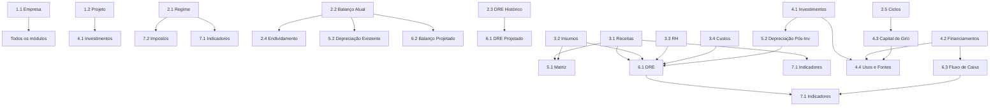

# ROADMAP DE SPRINTS - MÓDULO FINANCIAMENTO
## Versão 3.0 - Navegação Hierárquica Funcional (7 Seções / 23 Tabs)

**Documento:** Sequência completa de execução dos sprints do módulo de financiamento
**Data:** 2025-10-18
**Versão:** 3.0 (Sprint 0 Concluído - Navegação Funcional)
**Autor:** Claude Code

---

## 📋 ÍNDICE

1. [Status Atual](#status-atual)
2. [Sprint 0: Navegação Hierárquica](#sprint-0-navegação-hierárquica-concluído)
3. [Estrutura Definitiva (7 Seções / 23 Tabs)](#estrutura-definitiva-7-seções--23-tabs)
4. [Mapeamento Completo de Seções](#mapeamento-completo-de-seções)
5. [Sequência de Execução dos Sprints](#sequência-de-execução-dos-sprints)
6. [Detalhamento dos Sprints](#detalhamento-dos-sprints)
7. [Cronograma e Estimativas](#cronograma-e-estimativas)

---

## 📊 STATUS ATUAL

### Sprints Completos (7 de 25)

| Sprint | Tab | Seção/Subseção | Status | Arquivo Principal | Linhas |
|--------|-----|----------------|--------|-------------------|--------|
| ✅ **0** | - | **Navegação Hierárquica** | **Completo** | `tabs.js`, `formulario-financiamento.html` | **+2399** |
| ✅ 1 | - | DynamicTable Component | Completo | `dynamic-table.js` | ~800 |
| ✅ 2 | - | Componentes Auxiliares | Completo | `currency-input.js`, `percentage-input.js` | ~500 |
| ✅ 3 | - | Schema IndexedDB | Completo | `financiamento-indexeddb-schema.js` | ~463 |
| ✅ 4 | 1 | 1.1 - Empresa | Completo | `secao-empresa.js` | ~525 |
| ✅ 7 | 2 | 1.2 - Projeto | Completo | `secao-projeto.js` | ~400 |
| ✅ 8 | 12 | 4.1 - Investimentos | Completo | `secao-investimentos.js` | ~600 |

**Progresso:** 7/25 sprints (28%)
**Linhas de código:** ~5.687 linhas

### 🎉 MARCO: SPRINT 0 CONCLUÍDO (2025-10-18)

**Navegação hierárquica de 2 níveis 100% funcional:**
- ✅ 7 seções principais no navbar superior
- ✅ 23 tabs distribuídos nas subsection-navbars
- ✅ Todos os form-sections carregando corretamente
- ✅ 13 tabs protegidos (modo Analista)
- ✅ 10 tabs públicos (modo Usuário)
- ✅ Auto-save e validação integrados

**3 Bugs Críticos Corrigidos:**
- ✅ BUG #1: Seletor ambíguo (querySelector pegava button ao invés de form-section)
- ✅ BUG #2: CSS inline bloqueando subtabs (`style="display: none;"`)
- ✅ BUG #3: Validação de seção incorreta (9→7 seções)

---

## 🏆 SPRINT 0: NAVEGAÇÃO HIERÁRQUICA (✅ CONCLUÍDO)

### Objetivo

Implementar sistema de navegação hierárquica de 2 níveis para melhorar UX e reduzir poluição visual.

### Estrutura Implementada

**NÍVEL 1:** Navbar superior com **7 SEÇÕES PRINCIPAIS**
**NÍVEL 2:** Subsection-navbars com **23 TABS**

### Visualização do Navbar

```
┌─────────────────────────────────────────────────────────────────────┐
│ [1. Identificação ▼] [2. Situação Atual ▼] [3. Operações Projetadas ▼] │
│ [4. Investimentos e Funding ▼] [5. Integrações ▼]                   │
│ [6. Demonstrativos Projetados ▼] [7. Análises e Decisão ▼]          │
└─────────────────────────────────────────────────────────────────────┘
```

**Exemplo: Ao clicar em "2. Situação Atual ▼":**

```
┌─────────────────────────────────────────────────────────────────────┐
│ 2. SITUAÇÃO ATUAL                                                    │
├─────────────────────────────────────────────────────────────────────┤
│ [2.1 Regime] [2.2 Balanço] [2.3 DRE Histórico]                      │
│ [2.4 Endividamento 🔒] [2.5 Ciclos Financeiros 🔒]                   │
└─────────────────────────────────────────────────────────────────────┘
```

### Arquivos Modificados

| Arquivo | Mudanças | Linhas |
|---------|----------|--------|
| `formulario-financiamento.html` | Navbar hierárquico + 23 form-sections (7 placeholders) | +405 |
| `tabs.js` | HierarchicalNavigation class + sectionMap | +621 |
| `financiamento-styles.css` | Estilos navegação 2 níveis | +246 |
| `ROADMAP_SPRINTS_CORRIGIDO.md` | Documentação | +1211 |

**Total:** +2.483 linhas, 4 arquivos modificados

### Bugs Corrigidos

#### BUG #1: Seletor Ambíguo (CRÍTICO)

**Problema:**
`querySelector('[data-section="${tabNumber}"]')` retornava **section-button** ao invés de **form-section**, pois `data-section` é usado em ambos elementos.

**Sintoma:**
Form-sections não carregavam ao clicar nos tabs.

**Correção (tabs.js:207):**
```javascript
// ❌ ANTES (ambíguo)
const targetSection = document.querySelector(`[data-section="${tabNumber}"]`);

// ✅ DEPOIS (específico)
const targetSection = document.querySelector(`.form-section[data-section="${tabNumber}"]`);
```

#### BUG #2: CSS Inline Bloqueando Subtabs (CRÍTICO)

**Problema:**
`style="display: none;"` inline nas subsection-navbars (seções 2-7) tinha **prioridade máxima** sobre classes CSS, impedindo que `.active { display: flex; }` funcionasse.

**Sintoma:**
Subtabs invisíveis mesmo quando seção estava ativa.

**Correção (formulario-financiamento.html linhas 122, 149, 172, 195, 210, 229):**
```html
<!-- ❌ ANTES -->
<div class="subsection-navbar" data-parent-section="2" style="display: none;">

<!-- ✅ DEPOIS -->
<div class="subsection-navbar" data-parent-section="2">
```

**Removido CSS inline de 6 subsection-navbars.**

#### BUG #3: Validação de Seção Incorreta

**Problema:**
Validação aceitava seções 8 e 9, que não existem na estrutura de 7 seções.

**Correção (tabs.js:115):**
```javascript
// ❌ ANTES
if (sectionNumber < 1 || sectionNumber > 9) return;

// ✅ DEPOIS
if (sectionNumber < 1 || sectionNumber > 7) return;
```

### Código-Chave: sectionMap

```javascript
// tabs.js linha 18-26
this.sectionMap = {
    1: [1, 2],           // Identificação (2 tabs)
    2: [3, 4, 5, 6, 7],  // Situação Atual (5 tabs)
    3: [8, 9, 10, 11],   // Operações Projetadas (4 tabs)
    4: [12, 13, 14, 15], // Investimentos e Funding (4 tabs)
    5: [16, 17],         // Integrações (2 tabs)
    6: [18, 19, 20],     // Demonstrativos Projetados (3 tabs)
    7: [21, 22, 23]      // Análises e Decisão (3 tabs)
};

// Protected tabs (Analyst mode only)
this.protectedTabs = [6, 7, 13, 14, 15, 16, 17, 18, 19, 20, 21, 22, 23];
```

---

## 🗂️ ESTRUTURA DEFINITIVA (7 SEÇÕES / 23 TABS)

### Hierarquia Completa

```
📁 SEÇÃO 1: IDENTIFICAÇÃO
   └─ 1.1 Empresa (Tab 1)
   └─ 1.2 Projeto (Tab 2)

📁 SEÇÃO 2: SITUAÇÃO ATUAL
   └─ 2.1 Regime Tributário (Tab 3)
   └─ 2.2 Balanço Atual (Tab 4)
   └─ 2.3 DRE Histórico (Tab 5)
   └─ 2.4 Endividamento 🔒 (Tab 6)
   └─ 2.5 Ciclos Financeiros 🔒 (Tab 7)

📁 SEÇÃO 3: OPERAÇÕES PROJETADAS
   └─ 3.1 Receitas (Tab 8)
   └─ 3.2 Insumos (Tab 9)
   └─ 3.3 Mão-de-Obra (Tab 10)
   └─ 3.4 Custos (Tab 11)

📁 SEÇÃO 4: INVESTIMENTOS E FUNDING
   └─ 4.1 Investimentos Fixos (Tab 12)
   └─ 4.2 Financiamentos Solicitados 🔒 (Tab 13)
   └─ 4.3 Capital de Giro 🔒 (Tab 14)
   └─ 4.4 Usos e Fontes 🔒 (Tab 15)

📁 SEÇÃO 5: INTEGRAÇÕES
   └─ 5.1 Matriz Produto-Insumo (Tab 16)
   └─ 5.2 Depreciação e Amortização 🔒 (Tab 17)

📁 SEÇÃO 6: DEMONSTRATIVOS PROJETADOS
   └─ 6.1 DRE Projetado 🔒 (Tab 18)
   └─ 6.2 Balanço Projetado 🔒 (Tab 19)
   └─ 6.3 Fluxo de Caixa 🔒 (Tab 20)

📁 SEÇÃO 7: ANÁLISES E DECISÃO
   └─ 7.1 Indicadores 🔒 (Tab 21)
   └─ 7.2 Impostos 🔒 (Tab 22)
   └─ 7.3 Cenários 🔒 (Tab 23)
```

### Diferenças vs Roadmap Anterior

| Mudança | Antes (v2.0) | Agora (v3.0) |
|---------|--------------|--------------|
| Número de seções | 9 seções | **7 seções** |
| Número de tabs | 18 tabs | **23 tabs** |
| Endividamento | Seção 5 (Investimentos) | **Seção 2 (Situação Atual)** |
| Ciclos Financeiros | Seção 5 | **Seção 2 (nova)** |
| Financiamentos | Junto com Endividamento | **Seção 4.2 (separado)** |
| Depreciação | Não existia | **Seção 5.2 (nova)** |
| Balanço Projetado | Não existia | **Seção 6.2 (nova)** |
| Tabs protegidos | 3 tabs (5.2, 5.3, 9.2, 9.3) | **13 tabs** |

### Conceitos-Chave

**Endividamento vs Financiamentos:**
- **Endividamento (Tab 6):** Dívidas EXISTENTES da empresa (curto/longo prazo, fornecedores, impostos)
- **Financiamentos (Tab 13):** Funding NOVO sendo solicitado para o projeto (BNDES, FCO, FINEP)

**Depreciação Segregada (Tab 17):**
- **Existente:** Depreciação de ativos atuais da empresa
- **Pós-Investimento:** Depreciação de novos ativos do projeto

---

## 🔢 MAPEAMENTO COMPLETO DE SEÇÕES

### SEÇÃO 1: IDENTIFICAÇÃO (Tabs 1-2)

| Tab | Subseção | Nome | Sprint | Status | Visibilidade | Arquivo |
|-----|----------|------|--------|--------|--------------|---------|
| 1 | **1.1** | Identificação da Empresa | 4 | ✅ Completo | Todos | `secao-empresa.js` |
| 2 | **1.2** | Caracterização do Projeto | 7 | ✅ Completo | Todos | `secao-projeto.js` |

**Descrição:**
Dados cadastrais da empresa (razão social, CNPJ, sócios, capital social) e informações gerais do projeto (tipo, objetivo, localização, cronograma).

**Funcionalidades Implementadas:**
- Quadro societário dinâmico (add/remove sócios)
- Validação capital total = 100%
- Campo `numeroSocios` readonly auto-calculado
- Integração IndexedDB completa

---

### SEÇÃO 2: SITUAÇÃO ATUAL (Tabs 3-7)

| Tab | Subseção | Nome | Sprint | Status | Visibilidade | Arquivo |
|-----|----------|------|--------|--------|--------------|---------|
| 3 | **2.1** | Regime Tributário e Premissas | Novo | 🔴 Pendente | Todos | - |
| 4 | **2.2** | Balanço Patrimonial Atual | 15 | 🔴 Pendente | Todos | - |
| 5 | **2.3** | DRE Histórico | Novo | 🔴 Pendente | Todos | - |
| 6 | **2.4** | Endividamento Atual | 14A | 🔴 Pendente | 🔒 Analista | - |
| 7 | **2.5** | Ciclos Financeiros | 11B | ✅ Implementado | Todos | secao-ciclos-financeiros.js |

**Descrição:**
Situação financeira atual da empresa antes do projeto.

**Tab 2.1 (Regime Tributário):**
- Regime tributário (Simples Nacional, Lucro Presumido, Lucro Real)
- TMA (Taxa Mínima de Atratividade)
- Inflação anual projetada
- Período de projeção (5 anos padrão)

**Tab 2.2 (Balanço Atual):**
- Ativo Circulante / Não Circulante
- Passivo Circulante / Não Circulante
- Patrimônio Líquido

**Tab 2.3 (DRE Histórico):**
- DRE dos últimos 3 anos
- Receita Bruta, Deduções, Receita Líquida
- Custos, Despesas, Lucro Líquido

**Tab 2.4 (Endividamento - PROTEGIDA):**
- Dívidas de curto prazo (fornecedores, impostos, salários)
- Dívidas de longo prazo (empréstimos bancários existentes)
- Sistemas de amortização (SAC/PRICE/Americano)

**Tab 2.5 (Ciclos Financeiros):**
- **Composição de Estoques (4 tipos):**
  - % Matéria-Prima + PME (dias)
  - % WIP (Produtos em Processo) + PME (dias)
  - % Produtos Acabados + PME (dias)
  - % Peças de Reposição + PME (dias)
  - Validação: percentuais devem somar 100%
- **Prazos Consolidados:**
  - PME Ponderado (calculado automaticamente = Σ(% × PME))
  - % Compras a Prazo (vs à vista)
- **Ciclos Calculados (readonly):**
  - Ciclo Operacional = PMR + PME Ponderado
  - Ciclo Financeiro = (PMR + PME Ponderado) - PMP
- **NCG (Necessidade de Capital de Giro - readonly):**
  - NCG Diária = (Receita × PMR/30) + (Custos × PME/30) - (Custos × PMP/30)
  - NCG Mensal = NCG Diária × 30
  - NCG Anual = NCG Mensal × 12

**Integração Cross-Tab:**
- Lê PMR/PMP de Tab 2.1 (Regime Tributário)
- Lê Receitas de Tab 8 (Receitas Projetadas)
- Calculador: `calculador-ciclos-financeiros.js` (NO FALLBACKS)

---

### SEÇÃO 3: OPERAÇÕES PROJETADAS (Tabs 8-11)

| Tab | Subseção | Nome | Sprint | Status | Visibilidade | Arquivo |
|-----|----------|------|--------|--------|--------------|---------|
| 8 | **3.1** | Produtos e Receitas Projetadas | 10 | 🔴 Pendente | Todos | - |
| 9 | **3.2** | Insumos e Matérias-Primas | 11 | 🔴 Pendente | Todos | - |
| 10 | **3.3** | Recursos Humanos | 13 | 🔴 Pendente | Todos | - |
| 11 | **3.4** | Custos Operacionais | 11A | 🔴 Pendente | Todos | - |

**Descrição:**
Projeções operacionais do projeto (60 meses).

**Tab 3.1 (Receitas):**
- Produtos/serviços fabricados
- Capacidade produtiva (unidades/mês)
- Preço de venda
- NCM/CFOP para cálculo de ICMS

**Tab 3.2 (Insumos):**
- Matérias-primas consumidas
- Quantidades por produto (Matriz Produto-Insumo)
- Preços de compra

**Tab 3.3 (Mão-de-Obra):**
- Quadro de funcionários (produção, administrativo, P&D)
- Salários base + encargos (INSS, FGTS, 13º, férias)

**Tab 3.4 (Custos):**
- Custos fixos (aluguel, seguros, manutenção)
- Custos variáveis (energia, água, logística)

---

### SEÇÃO 4: INVESTIMENTOS E FUNDING (Tabs 12-15)

| Tab | Subseção | Nome | Sprint | Status | Visibilidade | Arquivo |
|-----|----------|------|--------|--------|--------------|---------|
| 12 | **4.1** | Orçamento de Investimentos Fixos | 8 + 9A | ✅ Completo | Todos | `secao-investimentos.js` |
| 13 | **4.2** | Financiamentos Solicitados | 14B | 🔴 Pendente | 🔒 Analista | - |
| 14 | **4.3** | Necessidade de Capital de Giro | 11B | 🔴 Pendente | 🔒 Analista | - |
| 15 | **4.4** | Cronograma de Usos e Fontes | 10 | 🔴 Pendente | 🔒 Analista | - |

**Descrição:**
Investimentos fixos e funding do projeto.

**Tab 4.1 (Investimentos Fixos - COMPLETO):**
- ✅ Categorias: Terreno, Obras Civis, Máquinas, Equipamentos, Veículos, etc.
- ✅ Campos: quantidade, unidade, valor unitário, ano desembolso (0-240 meses)
- ✅ Origem dos recursos: Próprios vs Terceiros (%, valor)
- ✅ Depreciação (taxa anual)
- ✅ Suporte a 240 meses (Sprint 9A)

**Tab 4.2 (Financiamentos - PROTEGIDA):**
- Financiamentos NOVOS solicitados para o projeto
- Fontes: BNDES, FCO, FINEP, bancos comerciais
- Prazo: até 240 meses (20 anos)
- Carência: 0-60 meses
- Taxa de juros anual
- Sistemas de amortização: SAC, PRICE, Americano
- Geração automática de tabela de amortização

**Tab 4.3 (Capital de Giro - PROTEGIDA):**
- Cálculo automático de NCG baseado em Ciclos Financeiros (Tab 2.5)
- NCG mensal para primeiros 60 meses
- Fontes de cobertura: Capital social, Lucros retidos, Financiamento

**Tab 4.4 (Usos e Fontes - PROTEGIDA):**
- Cronograma consolidado de investimentos (0-240 meses)
- Detalhamento: Meses 0-59 (mensal) + Meses 60-239 (anual)
- Usos: Investimentos fixos, Capital de giro, Juros pré-operacionais
- Fontes: Recursos próprios, Financiamentos, Contrapartida

---

### SEÇÃO 5: INTEGRAÇÕES (Tabs 16-17)

| Tab | Subseção | Nome | Sprint | Status | Visibilidade | Arquivo |
|-----|----------|------|--------|--------|--------------|---------|
| 16 | **5.1** | Matriz Produto-Insumo | 12 | 🔴 Pendente | Todos | - |
| 17 | **5.2** | Depreciação e Amortização | Novo | 🔴 Pendente | 🔒 Analista | - |

**Descrição:**
Integrações entre seções operacionais e financeiras.

**Tab 5.1 (Matriz):**
- Relacionamento Produtos × Insumos
- Quantidades de insumo por unidade de produto
- Validação: Soma de insumos × Produção = Compras projetadas

**Tab 5.2 (Depreciação - PROTEGIDA):**
- **Depreciação Existente:** Ativos atuais da empresa (do Balanço Atual)
- **Depreciação Pós-Investimento:** Novos ativos do projeto (Investimentos Fixos)
- Cálculo mensal para DRE projetado
- Taxas: Linear, Acelerada, ou Customizada

---

### SEÇÃO 6: DEMONSTRATIVOS PROJETADOS (Tabs 18-20)

| Tab | Subseção | Nome | Sprint | Status | Visibilidade | Arquivo |
|-----|----------|------|--------|--------|--------------|---------|
| 18 | **6.1** | DRE Projetado | 17 | 🔴 Pendente | 🔒 Analista | - |
| 19 | **6.2** | Balanço Projetado | Novo | 🔴 Pendente | 🔒 Analista | - |
| 20 | **6.3** | Fluxo de Caixa | 18 | 🔴 Pendente | 🔒 Analista | - |

**Descrição:**
Demonstrações financeiras consolidadas (geradas automaticamente).

**Tab 6.1 (DRE - PROTEGIDA):**
- Projeção anual para 5 anos
- Receita Bruta → Deduções → Receita Líquida
- CMV → Lucro Bruto → Despesas → EBITDA → Lucro Líquido
- Integração: Receitas (3.1), Custos (3.4), Depreciação (5.2)

**Tab 6.2 (Balanço - PROTEGIDA):**
- Projeção anual para 5 anos
- Ativo: Circulante (Caixa, NCG) + Não Circulante (Imobilizado - Depreciação)
- Passivo: Circulante + Não Circulante (Financiamentos)
- Patrimônio Líquido: Capital Social + Lucros Acumulados

**Tab 6.3 (Fluxo de Caixa - PROTEGIDA):**
- Projeção mensal para 60 meses
- Operacional: Recebimentos - Pagamentos
- Investimento: Aquisição de ativos
- Financiamento: Captação - Amortização
- Saldo Final = Saldo Inicial + Fluxo Período

---

### SEÇÃO 7: ANÁLISES E DECISÃO (Tabs 21-23)

| Tab | Subseção | Nome | Sprint | Status | Visibilidade | Arquivo |
|-----|----------|------|--------|--------|--------------|---------|
| 21 | **7.1** | Dashboard de Indicadores | 19 | 🔴 Pendente | 🔒 Analista | - |
| 22 | **7.2** | Cálculo de Impostos | Novo | 🔴 Pendente | 🔒 Analista | - |
| 23 | **7.3** | Análise de Cenários | 23 | 🔴 Pendente | 🔒 Analista | - |

**Descrição:**
Análises financeiras para tomada de decisão.

**Tab 7.1 (Indicadores - PROTEGIDA):**
- **VPL** (Valor Presente Líquido) com TMA
- **TIR** (Taxa Interna de Retorno)
- **Payback Simples** e **Descontado**
- **Ponto de Equilíbrio** (unidades e faturamento)
- **ROI** (Return on Investment)
- Visualização: Cards + Gráficos

**Tab 7.2 (Impostos - PROTEGIDA):**
- Cálculo detalhado de ICMS (próprio + ST)
- PIS/COFINS (regime cumulativo vs não-cumulativo)
- IRPJ e CSLL (alíquotas por regime)
- Benefícios fiscais (Produzir, Fomentar, ProGoiás, CEI)
- Economia fiscal mensal/anual

**Tab 7.3 (Cenários - PROTEGIDA):**
- Análise de sensibilidade (variação de receitas, custos, TMA)
- Cenários: Otimista (+20%), Realista (base), Pessimista (-20%)
- Simulação de Monte Carlo (opcional)
- Comparação de VPL/TIR entre cenários

---

### Resumo: Visibilidade por Modo

**Modo Usuário:** 10 tabs visíveis
- Seção 1: 1.1, 1.2 (2 tabs)
- Seção 2: 2.1, 2.2, 2.3 (3 tabs)
- Seção 3: 3.1, 3.2, 3.3, 3.4 (4 tabs)
- Seção 4: 4.1 (1 tab)
- Seção 5: 5.1 (1 tab)
- **Seções 6 e 7:** Ocultas (todas protegidas)

**Modo Analista:** 23 tabs visíveis (todas)
- Adiciona: 2.4, 2.5, 4.2, 4.3, 4.4, 5.2, 6.1, 6.2, 6.3, 7.1, 7.2, 7.3 (13 tabs protegidas)

---

## 🎯 SEQUÊNCIA DE EXECUÇÃO DOS SPRINTS

### ✅ FASE 0: NAVEGAÇÃO HIERÁRQUICA (CONCLUÍDO)
**Duração:** 4-5 horas
**Status:** ✅ Concluído em 2025-10-18

- ✅ **Sprint 0:** Navegação Hierárquica (7 seções / 23 tabs)
  - HTML: Navbar hierárquico + 23 form-sections
  - JS: HierarchicalNavigation class
  - CSS: Estilos de 2 níveis
  - Correção de 3 bugs críticos

---

### FASE 1: FUNDAÇÕES (Sprints 1-3) - ✅ COMPLETO
**Duração:** 8-10 horas
**Status:** ✅ Completo

- ✅ **Sprint 1:** DynamicTable Component (~800 linhas)
- ✅ **Sprint 2:** CurrencyInput + PercentageInput (~500 linhas)
- ✅ **Sprint 3:** Schema IndexedDB (~463 linhas)

---

### FASE 2: IDENTIFICAÇÃO E PROJETO (Sprints 4-7) - ✅ 2 DE 4
**Duração:** 12-16 horas
**Progresso:** 50%

- ✅ **Sprint 4:** Tab 1 - Identificação da Empresa (Seção 1.1)
- ⏸️ **Sprint 5:** Tab 3 - Regime Tributário (Seção 2.1) - PENDENTE
- ⏸️ **Sprint 6:** Tab 4 - Balanço Atual (Seção 2.2) - PENDENTE
- ✅ **Sprint 7:** Tab 2 - Caracterização do Projeto (Seção 1.2)

---

### FASE 3: INVESTIMENTOS (Sprints 8-9A) - ✅ 1 DE 2
**Duração:** 6-8 horas
**Progresso:** 50%

- ✅ **Sprint 8:** Tab 12 - Investimentos Fixos (Seção 4.1)
- ⏸️ **Sprint 9A:** Ajuste 240 meses no Tab 12 - PENDENTE

---

### FASE 4: OPERAÇÕES (Sprints 10-13) - 🟡 0.5 DE 6
**Duração:** 16-20 horas
**Progresso:** 8.3%

- 🔴 **Sprint 10:** Tab 8 - Receitas Projetadas (Seção 3.1)
- 🔴 **Sprint 11:** Tab 9 - Insumos (Seção 3.2)
- 🔴 **Sprint 11A:** Tab 11 - Custos (Seção 3.4)
- 🟡 **Sprint 11B:** Tab 7 - Ciclos Financeiros (Seção 2.5) - ✅ CONCLUÍDO | Tab 14 - Capital de Giro (Seção 4.3) - 🔴 PENDENTE
- 🔴 **Sprint 12:** Tab 16 - Matriz Produto-Insumo (Seção 5.1)
- 🔴 **Sprint 13:** Tab 10 - Recursos Humanos (Seção 3.3)

---

### FASE 5: FINANCIAMENTO E CRONOGRAMA (Sprints 14-15) - 🔴 0 DE 3
**Duração:** 8-12 horas
**Progresso:** 0%

- 🔴 **Sprint 14A:** Tab 6 - Endividamento Atual (Seção 2.4)
- 🔴 **Sprint 14B:** Tab 13 - Financiamentos Solicitados (Seção 4.2)
- 🔴 **Sprint 15:** Tab 15 - Usos e Fontes (Seção 4.4)

---

### FASE 6: DEMONSTRAÇÕES FINANCEIRAS (Sprints 16-18) - 🔴 0 DE 4
**Duração:** 12-16 horas
**Progresso:** 0%

- 🔴 **Sprint 16:** Tab 5 - DRE Histórico (Seção 2.3)
- 🔴 **Sprint 17:** Tab 18 - DRE Projetado (Seção 6.1)
- 🔴 **Sprint 17A:** Tab 17 - Depreciação Segregada (Seção 5.2)
- 🔴 **Sprint 18:** Tab 20 - Fluxo de Caixa (Seção 6.3)
- 🔴 **Sprint 18A:** Tab 19 - Balanço Projetado (Seção 6.2)

---

### FASE 7: ANÁLISES E DECISÃO (Sprints 19-23) - 🔴 0 DE 5
**Duração:** 16-20 horas
**Progresso:** 0%

- 🔴 **Sprint 19:** Tab 21 - Indicadores (Seção 7.1)
- 🔴 **Sprint 20:** Tab 22 - Impostos (Seção 7.2)
- 🔴 **Sprint 21:** Integração ICMS Calculator
- 🔴 **Sprint 22:** Reforma Tributária (CBS/IBS)
- 🔴 **Sprint 23:** Tab 23 - Cenários (Seção 7.3)

---

### FASE 8: FINALIZAÇÃO (Sprint 24-25) - 🔴 0 DE 2
**Duração:** 6-8 horas
**Progresso:** 0%

- 🔴 **Sprint 24:** Validação Cross-Section + Auto-Save
- 🔴 **Sprint 25:** Testes E2E + Documentação Final

---

## 📅 CRONOGRAMA E ESTIMATIVAS

### Resumo por Fase

| Fase | Sprints | Status | Duração | Progresso |
|------|---------|--------|---------|-----------|
| **0. Navegação** | 0 | ✅ Completo | 4-5h | 100% (1/1) |
| **1. Fundações** | 1-3 | ✅ Completo | 8-10h | 100% (3/3) |
| **2. Identificação** | 4-7 | 🟡 Parcial | 12-16h | 50% (2/4) |
| **3. Investimentos** | 8-9A | 🟡 Parcial | 6-8h | 50% (1/2) |
| **4. Operações** | 10-13 | 🔴 Pendente | 16-20h | 0% (0/6) |
| **5. Financiamento** | 14-15 | 🔴 Pendente | 8-12h | 0% (0/3) |
| **6. Demonstrações** | 16-18 | 🔴 Pendente | 12-16h | 0% (0/5) |
| **7. Análises** | 19-23 | 🔴 Pendente | 16-20h | 0% (0/5) |
| **8. Finalização** | 24-25 | 🔴 Pendente | 6-8h | 0% (0/2) |

**Total:** 25 sprints, 88-115 horas estimadas, 28% concluído (7/25)

### Próximo Sprint Recomendado

**Sprint 5: Tab 3 - Regime Tributário (Seção 2.1)**

**Por quê?**
- Fundação para cálculos tributários de todo o sistema
- Define TMA (usado em VPL/TIR)
- Define inflação (ajuste de valores)
- Bloqueia Sprint 20 (Impostos) e Sprint 19 (Indicadores)

**Estimativa:** 2-3 horas

**Campos:**
- Regime: Simples Nacional / Lucro Presumido / Lucro Real (select)
- TMA (%): Taxa Mínima de Atratividade (number, default 12%)
- Inflação Anual (%): IPCA projetado (number, default 4.5%)
- Período Projeção: Anos (number, default 5, min 3, max 10)
- Ano Base: Ano inicial (number, default ano atual)

---

## 🔗 MATRIZ DE DEPENDÊNCIAS

### Dependências de Dados (Quem usa dados de quem)



### Dependências de Código (Módulos JavaScript)

```
┌─────────────────────────────────────────────────────────┐
│ CAMADA 1: FUNDAÇÃO                                      │
├─────────────────────────────────────────────────────────┤
│ • dynamic-table.js                                      │
│ • currency-input.js                                     │
│ • percentage-input.js                                   │
│ • financiamento-indexeddb-schema.js                     │
│ • tabs.js (HierarchicalNavigation)                      │
└─────────────────────────────────────────────────────────┘
                        ↓
┌─────────────────────────────────────────────────────────┐
│ CAMADA 2: SEÇÕES DE INPUT                               │
├─────────────────────────────────────────────────────────┤
│ • secao-empresa.js (Tab 1)                              │
│ • secao-projeto.js (Tab 2)                              │
│ • secao-regime.js (Tab 3) ← PRÓXIMO                     │
│ • secao-balanco-atual.js (Tab 4)                        │
│ • secao-investimentos.js (Tab 12) ✅                    │
│ • secao-receitas.js (Tab 8)                             │
│ • secao-insumos.js (Tab 9)                              │
│ • secao-rh.js (Tab 10)                                  │
│ • secao-custos.js (Tab 11)                              │
└─────────────────────────────────────────────────────────┘
                        ↓
┌─────────────────────────────────────────────────────────┐
│ CAMADA 3: CALCULADORES                                  │
├─────────────────────────────────────────────────────────┤
│ • calculador-ciclos.js (Tab 7)                          │
│ • calculador-ncg.js (Tab 14)                            │
│ • calculador-depreciacao.js (Tab 17)                    │
│ • calculador-financiamentos.js (Tab 13)                 │
│ • calculador-matriz.js (Tab 16)                         │
└─────────────────────────────────────────────────────────┘
                        ↓
┌─────────────────────────────────────────────────────────┐
│ CAMADA 4: DEMONSTRATIVOS                                │
├─────────────────────────────────────────────────────────┤
│ • calculador-dre.js (Tab 18)                            │
│ • calculador-fluxo-caixa.js (Tab 20)                    │
│ • calculador-balanco-projetado.js (Tab 19)              │
└─────────────────────────────────────────────────────────┘
                        ↓
┌─────────────────────────────────────────────────────────┐
│ CAMADA 5: ANÁLISES                                      │
├─────────────────────────────────────────────────────────┤
│ • calculador-indicadores.js (Tab 21)                    │
│ • tax-calculator-core.js (Tab 22)                       │
│ • calculador-cenarios.js (Tab 23)                       │
└─────────────────────────────────────────────────────────┘
```

---

## 📝 NOTAS IMPORTANTES

### Suporte a 240 Meses (20 anos)

**Implementado em:**
- ✅ Tab 12 (Investimentos Fixos) - Campo `mesDesembolso` 0-240

**Pendente de implementação:**
- 🔴 Tab 13 (Financiamentos) - Amortização até 240 parcelas
- 🔴 Tab 15 (Usos e Fontes) - Cronograma híbrido:
  - Meses 0-59: Detalhamento mensal (60 linhas)
  - Meses 60-239: Consolidação anual (15 linhas)

### Princípios de Desenvolvimento (NO FALLBACKS)

1. **Zero Fallbacks:** Valores default apenas em HTML (visíveis ao usuário)
2. **Exceções Explícitas:** `throw new Error()` ao invés de valores silenciosos
3. **Empty State Handling:** Mensagens neutras vs erros quando campos vazios
4. **Single Source of Truth:** Módulo que cria, nomeia - demais seguem
5. **Manual Clone Pattern:** Consistente com seções existentes (não DynamicTable)

### Estrutura IndexedDB

**Database:** `expertzy_financiamento` v1
**4 Object Stores:**
1. `formulario` - Dados simples (campos de texto, selects)
2. `dynamicTables` - 126 tabelas dinâmicas
3. `autosave` - Backup temporário
4. `calculatedResults` - Cache de cálculos

**API Global:** `window.FinanciamentoIndexedDB`

---

## 🎯 PRÓXIMOS PASSOS

### Imediato (Sprint 5)

**Tab 3 - Regime Tributário (Seção 2.1)**
- Criar `secao-regime.js` (~200 linhas)
- Form simples (5 campos)
- Validação de TMA (6-30%) e inflação (0-15%)
- Integração IndexedDB

**Estimativa:** 2-3 horas

### Curto Prazo (Sprints 6-9A)

1. **Sprint 6:** Tab 4 - Balanço Atual (3-4h)
2. **Sprint 9A:** Ajuste 240 meses em Investimentos (1-2h)

**Estimativa:** 4-6 horas, completa Fase 2 e Fase 3

### Médio Prazo (Sprints 10-15)

Completar Fase 4 (Operações) e Fase 5 (Financiamento).

**Estimativa:** 24-32 horas, habilita cálculos de DRE e Fluxo de Caixa

---

**Fim do Roadmap v3.0**

**Última atualização:** 2025-10-18 após conclusão do Sprint 0
**Próxima revisão:** Após Sprint 5 (Regime Tributário)
